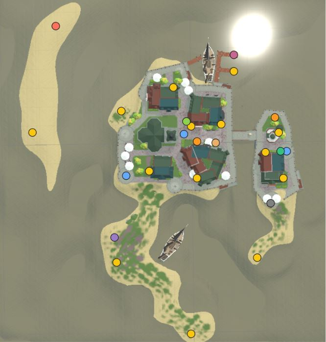

**Concepte:**
Ce jeu est inspiré de la série Call of Duty Black Ops Zombie de Activision. Un pirate s’échoue sur une île habitée par des zombies au plein milieu de l'océan Indien. Le joueur est destiné à mourir, mais il doit rester en vie le plus longtemps possible. Il peut perdre des points de vie de deux façons: en se noyant (toucher à l’eau) ou en se faisant tuer par les zombies (toucher à un zombie). Ce jeu se trouve à la première personne avec une mini-map en haut à gauche et il est possible d’ajuster la distance de celui-ci. Il y a un système d’argent qui permet au joueur de débloquer différentes armes, munitions, power ups et des sections sur la carte (île). Au début, le joueur a accès à une zone limitée de la carte. Il y a une "Boîte Mystère" au centre de la carte, où il est possible de dépenser de l’argent pour obtenir une arme aléatoire de qualité supérieure. L’autre façon d’acheter une arme est d’acheter ceux qui sont affichés sur les murs. Les zombies apparaissent en vagues. Chaque vague est plus difficile que la précédente, avec des zombies plus nombreux, plus rapides et plus résistants. Ceux-ci détruisent les fenêtres en bois pour afin apparaître sur la carte lorsqu’aucune planche est dans leur chemin. Il est possible de reconstruire ces barrières pour ralentir les zombies et faire un peu d’argent. Les zombies cherchent toujours à se rendre vers les joueurs. C’est la tâche au joueur de tuer les zombies avec les fusils et munitions qu’il peut trouver partout sur la carte. Parfois, le niveau de l’eau montera, donc il faut se rendre sur une des plateformes de sécurité ou sur le pont pour ne pas être touché par l’eau. L’eau infectée affaiblit le joueur et lui fait perdre de l’argent aux contacts. Les zombies ne sont pas affectés par l’eau s’il ne baigne pas trop longtemps. Le but est de survivre à autant de vagues que possible. Le jeu finit quand le joueur est mort par un zombie. Si le joueur possède tous ses points de vie, ça prend aux zombies trois coups sur le joueur dans un lapse de temps modérable pour le tuer. Après un moment sans prendre de dégât, le joueur se régénère jusqu’à 100%. Combien de ‘round’ pouvez vous survivre!

**Lien des ressources utilisés:**
- https://assetstore.unity.com/packages/3d/props/weapons/3d-guns-guns-pack-228975 
- https://assetstore.unity.com/packages/3d/characters/humanoids/fantasy/character-pack-zombie-sample-131604 
- https://assetstore.unity.com/packages/3d/props/exterior/low-poly-brick-houses-131899 
- https://assetstore.unity.com/packages/3d/environments/urban/low-poly-atm-153420 
- https://assetstore.unity.com/packages/3d/props/interior/crafting-table-160161 
- https://assetstore.unity.com/packages/3d/spiral-gumball-machine-87317 
- https://assetstore.unity.com/packages/2d/textures-materials/wood/mc-old-wod-free-sample-178802 
- https://assetstore.unity.com/packages/3d/props/weapons/ammo-box-7701 
- https://assetstore.unity.com/packages/3d/props/weapon-box-63084 
- https://assetstore.unity.com/packages/3d/props/pbr-dirty-jack-in-the-box-88659 
- https://assetstore.unity.com/packages/2d/textures-materials/stylized-lava-materials-180943 
- Tous les sons proviennent de Pixabay (libre de droit)

**Éléments de complexité choisi:**
- Jeu en 3D avec caméra différente et/ou plus complexe que le TP1.
Trois caméras différentes sont présentées. Le joueur en première personne avec une mini-map en haut à gauche. Il est possible d’ajuster la distance de celui-ci. Il y a des markers seulement visibles par la caméra troisième personne (minimap) pour facilement identifier les éléments à interagir et les zombies. Il est possible au joueur de changer l’ordre de caméra pour avoir une grande vue sur la caméra.  Il y a aussi une caméra qui tourne autour de la carte (Île) sur la scène de départ et sur la scène de la fin qui agit comme background.
- Interaction du joueur avec les éléments de la partie.
Le joueur peut interagir avec tous les éléments annoncés dans le tableaux plus bas. Une classe abstraite est utilisée et chaque classe des éléments utilise celui-ci pour ajouter un comportement (similaire aux états). Le joueur doit s’approcher des éléments afin de pouvoir interagir. On introduit un système d’argent pour pouvoir limiter l'interaction du joueur avec les différents éléments. Le jeu tourne autour de ces éléments. C’est grâce à ceux-ci que l’achat de ceux-ci peut faire un meilleur score lors d’une partie.

**Les éléments à interagir:**
| *Éléments*         | *Prix*    | *Emplacement*   | *Description*   |
|------------------|---------|---------------|---------------|
| WeaponBox        | -950$   | Section 2      | Cette boîte donne un fusible aléatoire au joueur après une animation sympathique.   |
| AmmoBox (x2)     | -500$   | Section 1 et 2 | C’est à cet endroit que le fusil peut être rechargé pour lui donner le maximum de munitions et le maximum de magazines.   |
| Perk1 (Speed Boost) | -1250$ | Section 4    | Cet atout ne peut être acheté qu’une seule fois. S’il est acheté une deuxième fois, il n'y aura aucun effet. Celui-ci permet au joueur de se déplacer plus rapidement.   |
| Perk2 (Speed Fire)  | -1250$ | Section 3  | Cet atout ne peut être acheté qu’une seule fois. S’il est acheté une deuxième fois, il n'y aura aucun effet. Celui-ci permet au joueur de se tirer des balles avec un temps d’attente entre les balles réduit.   |
| ATM (CHEAT)      | +2000$  | Section 1      | Il est possible pour le joueur d'accumuler de l’argent frauduleux afin de se rendre plus loin rapidement dans le jeu. (Bien pratique pour les testeurs)   |
| WallGun1         | -750$   | Section 1      | Une fois acheté, le fusil affiché au mur est maintenant dans les mains du joueur.   |
| WallGun2         | -1000$  | Section 2      | Une fois acheté, le fusil affiché au mur est maintenant dans les mains du joueur.   |
| UpgradingTable   | -3000$  | Section 4      | C’est à cet endroit que le fusil que tient le joueur peut être amélioré. Cela fait que les balles font plus de dégâts aux zombies. Lorsque le gun est échangé, l'amélioration disparaît.   |
| WoodenWindow     | +10$    | Toutes sections | Ces fenêtres sont où les zombies peuvent apparaître. Ils doivent d’abord détruire l'entièreté des planches de bois une par une avant de pouvoir s'échapper. Il est possible pour le joueur de reconstruire ces barrières pour faire de l’argent et ralentir l’apparition des zombies.   |
| SafeZone (x3)    | 0$      | Section 1 et 2 | Ces plateformes sont des endroits où l’eau ne peut pas atteindre le joueur, donc celui-ci peut survivre au niveau de l’eau qui augmente toutes les 2 minutes.   |

**Éléments du Hud :**
- Mire
- Le nombre de munition
- Le nombre de magazines
- Le nombre d’argent
- Minimap
- Game Over (temporaire)
- Pause (temporaire)
- Description des intéractions (temporaire)
- Recharger (temporaire)

**Éléments du Hud :**
- Changement des statistiques des zombies après une ‘round’:
- Taux d'apparition
- Zombie qui peut être actif en même temps
- Nombre maximum de zombies par ‘round’
- Vitesse des zombies
- Point de vie des zombies

**Changement des statistiques des gun :**
- Vitesse des balles
- Temps d’attente entre les balles
- Munitions maximales
- Maximum de magazines
- Taille de la balle
- Zombies touchés par une seule balle
- Dommages par balle
- Argent reçu par coup donné
- Temps d’attente pour recharger

**Contrôles :**
- [W,A,S,D] - Move player
- [Mouse] - Move camera 
- [Left Click] - Shoot
- [R] - Reload
- [Z] - Zoom minimap
- [X] - Unzoom minimap
- [E] - Interact with the elements
- [Q] - Change camera layout
